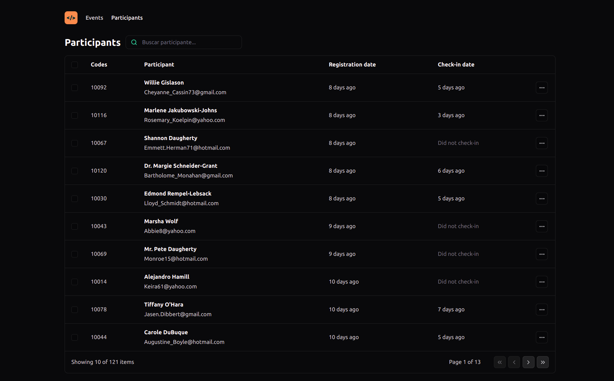
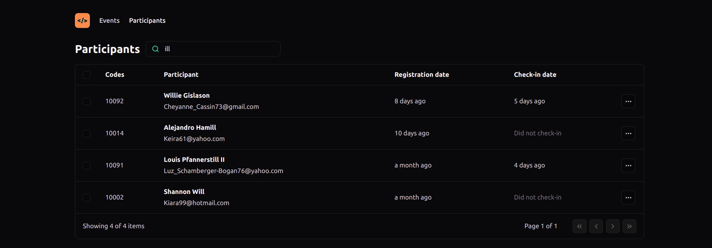

  <a href="#-technologies">Technologies</a>&nbsp;&nbsp;&nbsp;|&nbsp;&nbsp;&nbsp;
  <a href="#-project">Project</a>&nbsp;&nbsp;&nbsp;|&nbsp;&nbsp;&nbsp;
  <a href="#-how-to-run">How to run</a>&nbsp;&nbsp;&nbsp;|&nbsp;&nbsp;&nbsp;
  <a href="#-how-to-contribute">How to contribute</a>&nbsp;&nbsp;&nbsp;

 

# NLW Unite

## 🚀 Technologies

This project was developed with the following technologies:

- [Node.js](https://nodejs.org/en/) - v18.12.1
- [Npm](https://www.npmjs.com/) - 8.19.2
- [Vite](https://vitejs.dev/guide/) - ^5.3.1
- [TypeScript](https://www.typescriptlang.org/) - ^5.2.2
- [Tailwindcss](https://tailwindcss.com/) - ^3.4.4
- [Tailwind-merge](https://github.com/dcastil/tailwind-merge) - ^2.3.0
- [Tailwindcss/forms](https://github.com/tailwindlabs/tailwindcss-forms) - ^0.5.7
- [Day.js](https://day.js.org/) - ^1.11.11
- [Faker.js](https://fakerjs.dev/) - ^8.4.1
- [Lucide React](https://lucide.dev/guide/packages/lucide-react) - ^0.397.0

## 💻 Project

Project developed with Vite and TypeScript for an event manager.

NLW event on the [Rocketseat](https://www.rocketseat.com.br/) platform.

- [Back-end - API](https://github.com/leticea/nlw-unite-nodejs)

  

  

## ⚙️ How to run

- Clone the project.
- Clone the API project to run both.
- Go to the project folder and run 'npm install' (use 'yarn install' if that's your configuration).
- npm run dev to run the project on the indicated port.

## 🤔 How to contribute

- Fork this repository;
- Create a branch with your feature: `git checkout -b my-feature`;
- Commit your changes: `git commit -m 'feat: My new feature'`;
- Push to your branch: `git push origin my-feature`.

After your pull request is merged, you can delete your branch.

## 📝 License

This project is under the MIT license.
